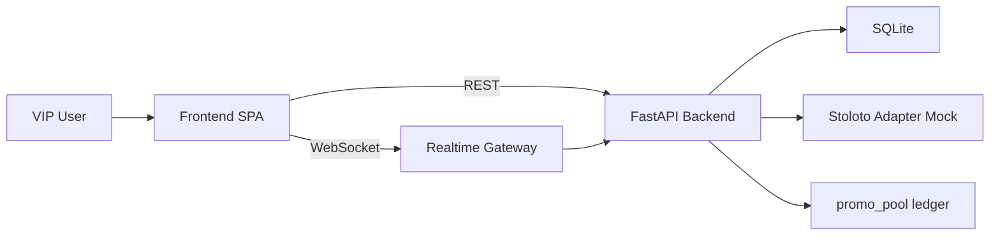

# MVP Plan: Stoloto VIP Opencase

## 1. Принятый технический baseline
- Backend: Python + FastAPI
- Database: SQLite
- Frontend: React + Vite
- Realtime: WebSocket
- Deployment: без Docker для MVP
- Экономическое правило: при победе бота бонусный фонд раунда возвращается в `promo_pool`

## 2. Снятые противоречия исходного ТЗ
- Конфликт backend-стека (`Python` vs `Spring Boot`) решен в пользу FastAPI.
- Конфликт БД (`SQLite` vs `PostgreSQL`) решен в пользу SQLite.
- Конфликт деплоя (упоминание `docker compose` при требовании «без Docker») решен: MVP без Docker, Docker как опциональное развитие.
- Термин «маржа» исключен из плановых формулировок, используется нейтральная модель распределения бонусного фонда.

## 3. Целевая архитектура MVP

### 3.1 Backend-модули
- `app/main.py` — точка входа FastAPI, маршруты и middleware.
- `app/api/rooms.py` — room/lobby endpoints.
- `app/api/admin.py` — конфигуратор и валидация.
- `app/api/history.py` — история раундов.
- `app/ws/room_ws.py` — WebSocket-каналы комнат.
- `app/services/rooms_service.py` — жизненный цикл комнат и matchmaking.
- `app/services/rng_service.py` — выбор победителя (только backend).
- `app/services/bonus_service.py` — резерв/списание/начисление бонусов.
- `app/services/config_service.py` — risk validation конфигураций.
- `app/services/history_service.py` — аудит и журналирование событий.
- `app/integrations/stoloto_adapter.py` — mock-адаптер reserve/update операций.

### 3.2 Frontend-модули
- `frontend-react/src/app` — shell приложения и роутинг.
- `frontend-react/src/features/lobby` — список комнат и фильтры.
- `frontend-react/src/features/room` — комната, таймер, участники, буст, рулетка.
- `frontend-react/src/features/admin` — конфигуратор и предупреждения.
- `frontend-react/src/shared/realtime` — подписка на room events.

### 3.3 Data flow


## 4. Backend бизнес-логика и state machine

### 4.1 Состояния комнаты
`WAITING -> LOCKED -> RUNNING -> FINISHED -> ARCHIVED`

### 4.2 Жизненный цикл
1. Пользователь входит в комнату.
2. Backend выполняет резерв бонусов через `reserveBonus()`.
3. Идет ожидание с таймером и realtime-обновлениями.
4. Пустые слоты заполняются ботами по правилам комнаты.
5. До старта разрешена ровно одна покупка буста на пользователя.
6. На `LOCKED` backend фиксирует участников/бусты.
7. Backend заранее определяет победителя (`winner_id`) и `itemData`.
8. Frontend получает `ROUND_RESULT` до старта анимации.
9. На `FINISHED` backend проводит бонусные транзакции и пишет историю.
10. Если победитель бот — призовой фонд зачисляется в `promo_pool`.

### 4.3 RNG
- Источник случайности: криптостойкий генератор Python.
- Базовый вес: `1.0`.
- Вес с бустом: `1.0 + boost_multiplier`.
- RNG вызывается только на backend в атомарном контексте завершения набора.
- Frontend не содержит вычисления победителя.

## 5. REST и WebSocket контракты

### 5.1 REST
- `GET /api/rooms` — список комнат, фильтры `entry_fee`, `seats`, `pool`.
- `POST /api/rooms/{id}/join` — вход и резерв бонусов.
- `POST /api/rooms/{id}/boost` — единоразовая покупка буста до lock.
- `GET /api/admin/config` — текущая конфигурация.
- `POST /api/admin/config` — обновление конфигурации с risk validation.
- `GET /api/history` — история раундов.

### 5.2 Стандарт ошибок
```json
{
  "code": "INSUFFICIENT_BONUS",
  "message": "Недостаточно бонусов для входа",
  "details": {"required": 1200, "available": 800},
  "trace_id": "..."
}
```

### 5.3 WebSocket events
- `ROOM_JOINED`
- `TIMER_TICK`
- `BOT_ADDED`
- `BOOST_ACTIVATED`
- `ROUND_RESULT`
- `ROUND_FINISHED`

Требование: порядок событий должен совпадать с backend state transitions.

## 6. Frontend UX и Opencase

### 6.1 Lobby
- Фильтры и быстрый подбор.
- Ручной вход в комнату.
- Обработка ошибок баланса с подсказкой более дешевых комнат.

### 6.2 Room
- Таймер ожидания ~60с.
- Список участников и индикаторы ботов.
- Кнопка буста доступна один раз до lock.

### 6.3 Анимация Opencase
- Формирование ленты: 60-80 элементов.
- Использование backend-полей `winIndex` и `itemData`.
- Формула offset:

`offset = (winIndex * itemWidth) + (itemWidth / 2) - (containerWidth / 2) + randomOffset`

- Фазы обязательно:
  - `launch`
  - `accel`
  - `decel`
  - `near_miss`
  - `stop`
  - `climax`

## 7. Админ-конфигуратор

### 7.1 Параметры
- `max_players`
- `entry_fee`
- `prize_pool_pct`
- `boost_cost`
- `boost_enabled`
- `boost_multiplier`

### 7.2 Risk validation
- `LOW`: сохранение разрешено.
- `MEDIUM`: сохранение после подтверждения.
- `HIGH`: сохранение блокируется.

Правила и формулы выносятся в `docs/economy-rules.md`.

## 8. Модель данных SQLite
- `users`
- `rooms`
- `room_participants`
- `boosts`
- `rounds`
- `round_results`
- `bonus_transactions`
- `promo_pool_ledger`
- `admin_configs`

### 8.1 Обязательные аудиты
- Все бонусные операции с idempotency key.
- Все переходы состояния комнаты с timestamp.
- Сохранение payload ключевых realtime-событий для разбора споров.

## 9. Нефункциональные требования
- Криптостойкий RNG.
- Идемпотентные финансовые операции.
- `trace_id` в каждом REST/WebSocket цикле.
- Структурные логи в JSON.
- Базовые лимиты на запросы в админ-эндпоинты.
- Подготовленный путь масштабирования:
  - переход на PostgreSQL,
  - Redis для таймеров/пабсаба,
  - вынос RNG и realtime в отдельные сервисы.

## 10. План реализации для Code mode
1. Создать каркас FastAPI проекта, конфигурацию, базовые модели SQLite.
2. Реализовать room lifecycle + matchmaking + авто-добавление ботов.
3. Реализовать RNG и precomputed result до анимации.
4. Реализовать бонусные транзакции и `promo_pool`-проводки для bot win.
5. Реализовать REST API и стандарт ошибок.
6. Реализовать WebSocket-события и гарантию порядка.
7. Реализовать фронтенд: Lobby + Room + realtime.
8. Реализовать Opencase-анимацию с near-miss без клиентских вычислений исхода.
9. Реализовать админ-конфигуратор с risk validation.
10. Добавить документацию: запуск, API-контракты, `docs/economy-rules.md`.
11. Провести e2e smoke-проверки по пользовательским сценариям MVP.

## 11. Acceptance checklist
- Победитель определяется только backend и до анимации.
- Клиент получает `ROUND_RESULT` до старта визуала.
- Буст покупается максимум один раз на пользователя в раунде.
- При победе бота фонд раунда отражается в `promo_pool_ledger`.
- Невалидные конфиги (`HIGH`) не сохраняются.
- Недостаток бонусов корректно блокирует вход/буст и показывает понятную ошибку.
- История раунда и бонусные транзакции полностью аудируются.

## 12. Подготовка к переключению в Code mode
После утверждения этого плана реализация может начаться по разделу `План реализации для Code mode` в указанном порядке.
